# It's Pawpal !!!
Hi, welcome to you from the PawPal team. This is a repository for our entire application, showing what we are and what we do.
PawPal is a RAG (Retrieval Augmented Generation) based intensive pet-care application. Enjoy surfing...

## Some Glances
### Demo
[YouTube Demo](https://www.youtube.com/watch?v=NIW0YMCwIME)
[Live Link](https://paw-protector-frontend.onrender.com)

### Dashboard
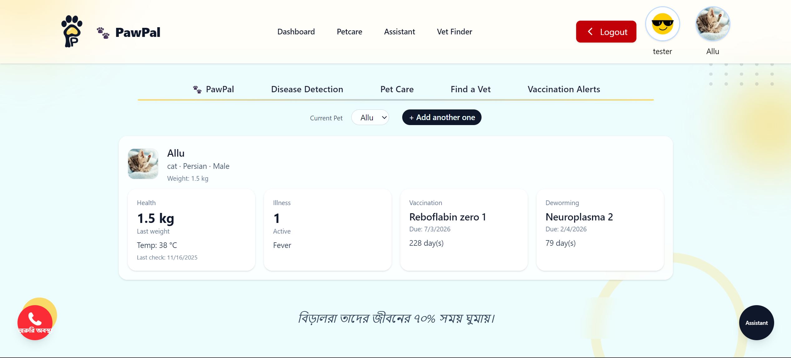 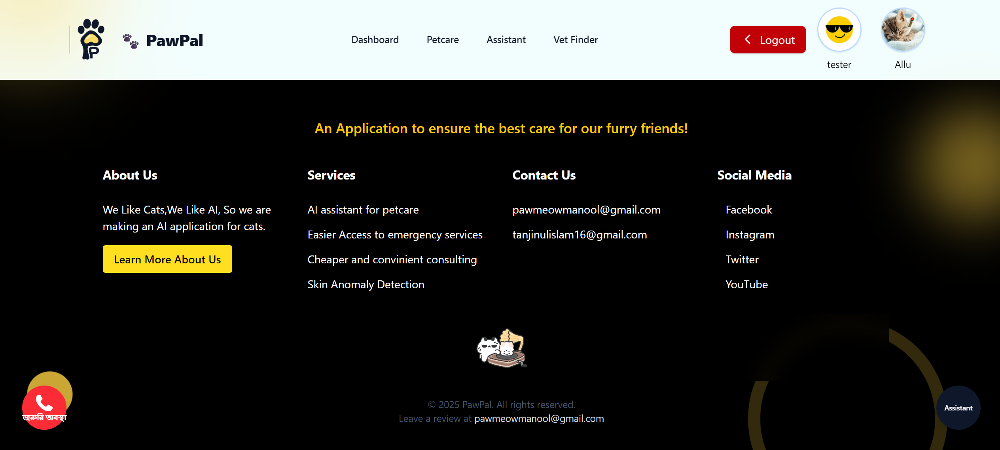

### What Are We
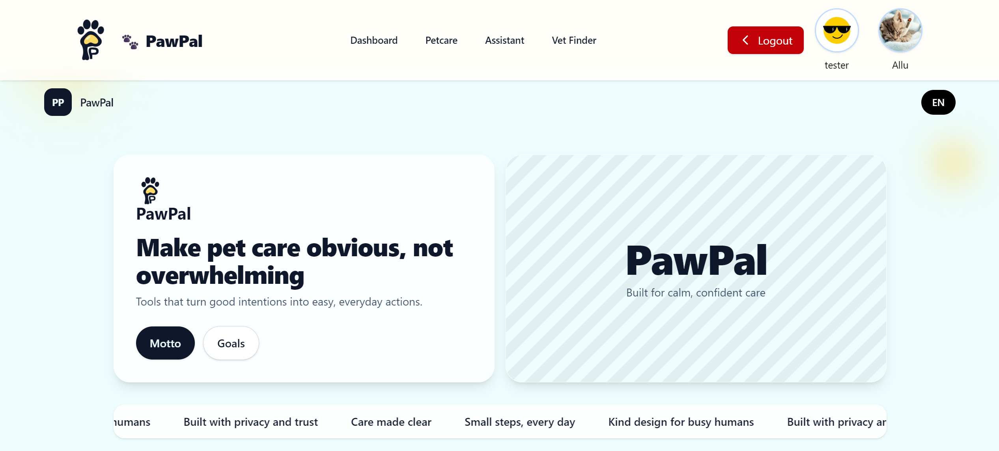 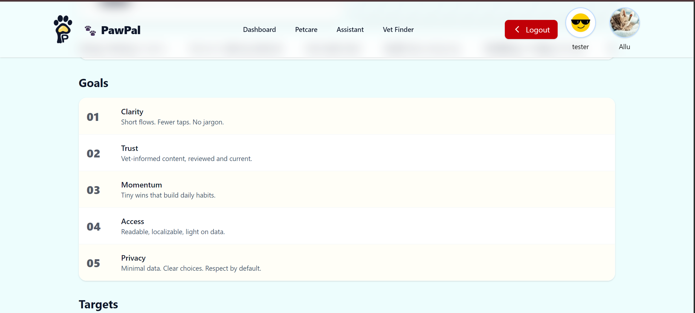  
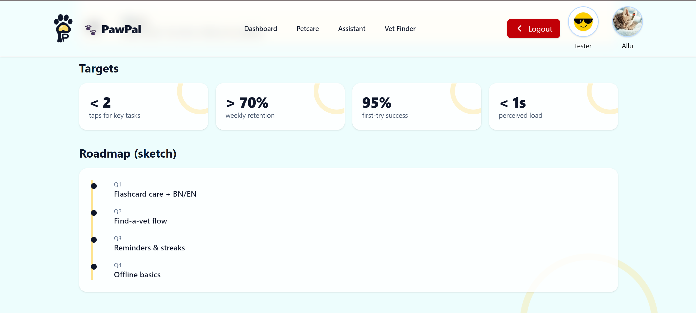

### Disease Detection
Custom trained classification model deployed on Hugging Face.
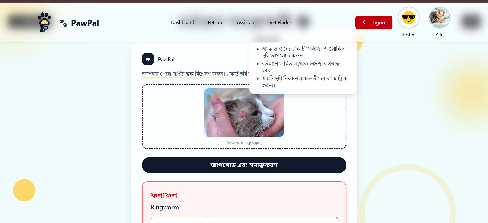

### Pet Care (RAG Enhanced)
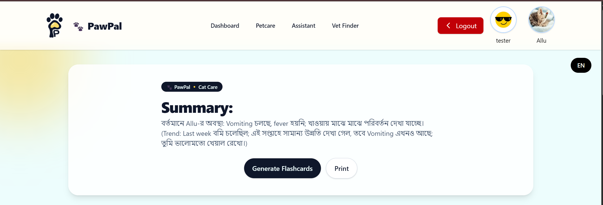 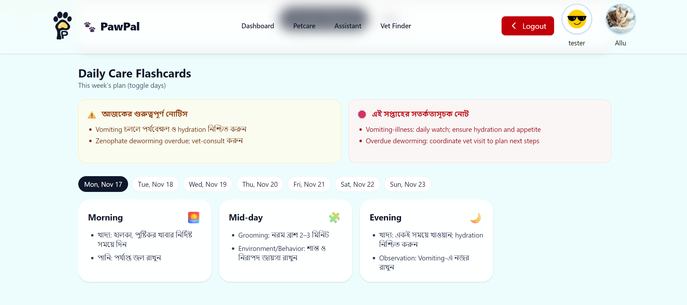  
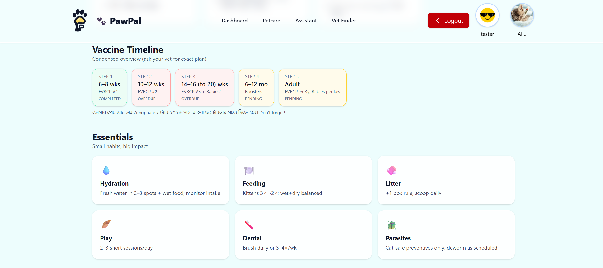

### Vet Finder
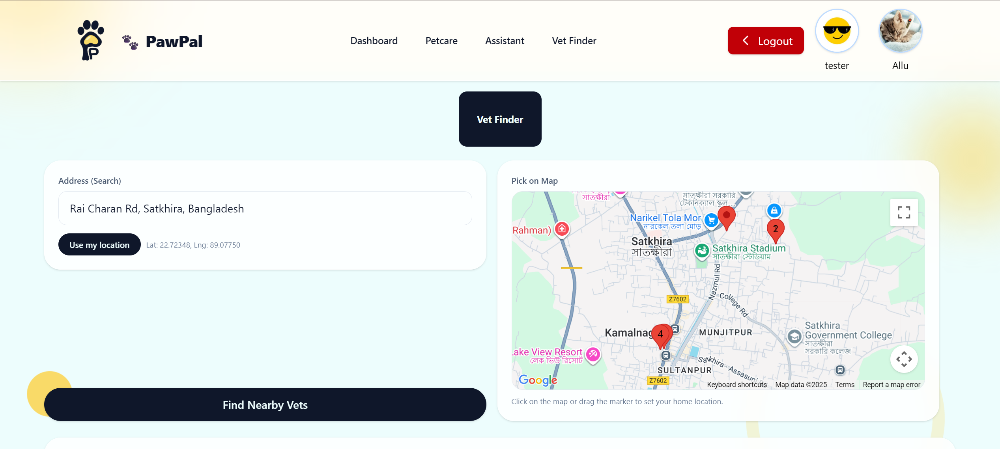 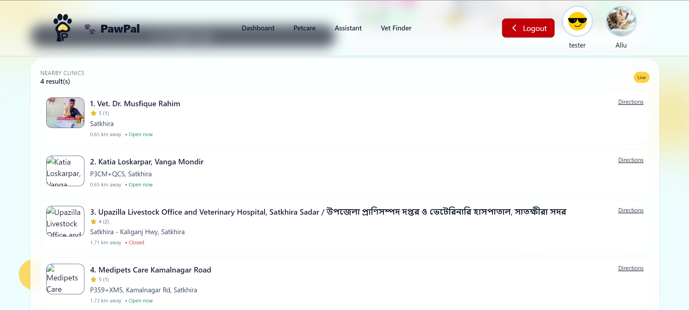

### Vaccination Alerts


### Chat Interface (RAG)
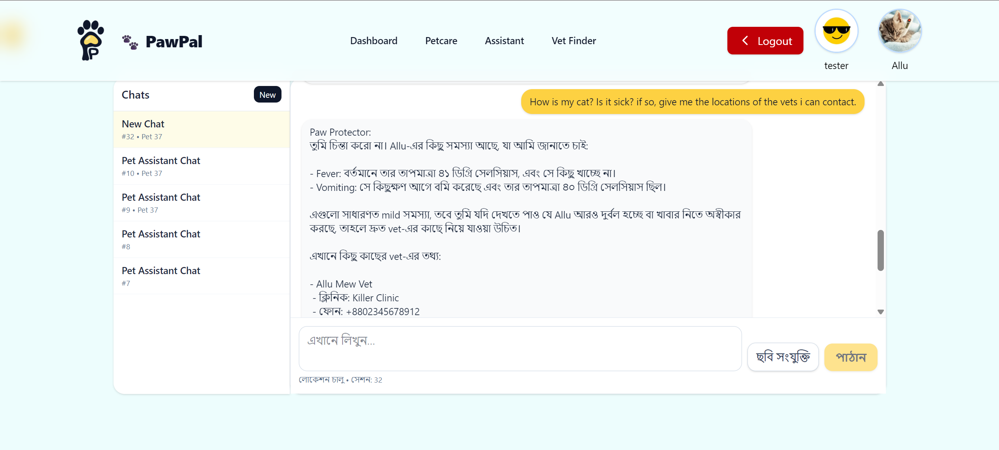

### Pet Profile (Data Feeds Retrieval Quality)
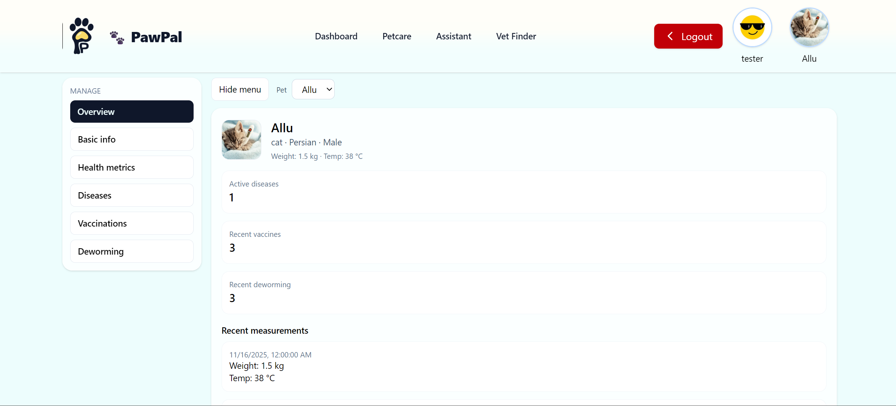

## Database Diagram
[DB Diagram](https://dbdiagram.io/d/Pawpal-Database-Model-690237e46735e11170551c76)

## Rough Architecture
[Architecture Link](https://app.eraser.io/workspace/xFOf4KClN6YouQQEBcP1?origin=share)


## So, what's next:
This is a project we built in 1-2 weeks. It's not polished, needs a lot of restructuring in here and we're gonna do that. That aside, it's open from now on. If you feel like Contributing or say, just viewing to learn something, read the CONTRIBUTING.md file, that has all the instructions on how to successfully setting up this whole project.

Also, do not forget to read the README.md files in ```/frontend``` and ```/backend``` directories.

Thanks for visiting. 😊
